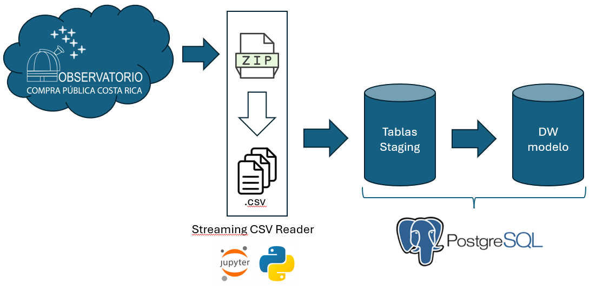

# SICOP-Python_ETL-PostgreSQL
El proyecto descarga automáticamente archivos mensuales publicados por el Observatorio de Compra Publica de Costa Rica, procesa grandes volúmenes de datos mediante una arquitectura de Streaming ETL, la almacena en un área de staging y construye un modelo dimensional optimizado para análisis de datos e inteligencia de negocios en PostgreSQL.

## Arquitectura

La arquitectura sigue un enfoque de Pipeline ETL en etapas: ingestión, almacenamiento temporal en tablas "staging" y construcción del modelo analítico.

<h2 align="center">Arquitectura General del Proyecto</h2>

<p align="center">
    
</p>

<p align="center">
    Pipeline ETL desarrollado para la plataforma SICOP Analytics.
</p>


## Flujo del proceso de ETL

1- Inicialmente es necesario crear las tablas del modelo de datos y un conjunto de tablas "staging" que conservan el historial completo de las cargas obtenidos desde la fuente (incluyendo registros duplicados).

2- Luego, se descarga un archivo ZIP correspondiente a un período mensual desde el portal de Observatorio de Compra Pública de Costa Rica.

3- Se extraen archivos CSV contenidos en el ZIP. Únicamente se trabajan los archivos y columnas de interés definidas en la configuración para cada archivo CSV.

4- Posteriormente, cada registro se carga a de las tablas staging recibe metadatos técnicos como: del proceso ETL que funcionan para:

    - etl_period: Periodo mensual de la descarga.
    
    - source_file: Nombre del archivo csv desde donde se obtuvieron los registros.
    
    - loaded_at: Fecha y hora del momento en que se cargaron los datos a las tablas staging.
    
    - batch_id: Identificador único para cada proceso de carga.
    
5- Los datos se cargan directamente en PostgreSQL mediante COPY a las tablas staging (las cuales . Se limitó el tamaño de cada lote de filas a un máximo de 100,000 para evitar sobrecargar la memoria local.

6- Mediante consultas SQL se eliminan duplicados conservando la versión más reciente de cada registro.

7- Finalmente, se construyen las tablas de dimensiones y hechos del modelo analítico.

# Guía para instalación de PostgreSQL y configuración de la base de datos

Esta guía explica cómo instalar PostgreSQL, crear la base de datos del proyecto y ejecutar el script SQL para inicializar la estructura de la base de datos.

---

# Requisitos

Antes de comenzar asegúrese de contar con:

- Windows, Linux o macOS.
- Permisos para instalar software.
- Descargar el jupiter notebook y los archivos SQL suministrado con el proyecto.

---

## 1. Instalar PostgreSQL

1. Ingrese al sitio oficial de PostgreSQL:

   https://www.postgresql.org/download/

2. Descargue la versión correspondiente a su sistema operativo.

3. Durante la instalación asegúrese de instalar también **pgAdmin 4**, ya que será la herramienta utilizada para administrar la base de datos.

4. Complete la instalación utilizando los siguientes parámetros:

| Parámetro | Valor |
|-----------|-------|
| Usuario | `postgres` |
| Contraseña | Definir una contraseña segura y fácil de recordar |
| Puerto | `5432` (valor por defecto) |

5. Finalice el asistente de instalación.

---

## 2. Abrir pgAdmin

1. Ejecute **pgAdmin 4**.

2. La primera vez se solicitará una **Master Password**.

> **Nota**
>
> Esta contraseña únicamente protege el acceso a pgAdmin y **no corresponde** a la contraseña del servidor PostgreSQL.

3. Una vez abierto, en el panel izquierdo deberá aparecer el servidor PostgreSQL.

Si no aparece, registre uno nuevo utilizando la siguiente configuración:

| Parámetro | Valor |
|-----------|-------|
| Nombre | `Proyecto SICOP` |
| Host | `localhost` |
| Puerto | `5432` |
| Usuario | `postgres` |
| Contraseña | La definida durante la instalación |

---

## 3. Crear la Base de Datos

En pgAdmin:

1. Expandir el servidor PostgreSQL.
2. Expandir **Databases**.
3. Clic derecho sobre **Databases**.
4. Seleccionar:

```
Create → Database...
```

5. En **Database** escribir:

```
proyecto_sicop_v1
```

6. Verificar que el propietario (**Owner**) sea:

```
postgres
```

7. Presionar **Save**.

---

## 4. Abrir el Editor SQL

Seleccionar la base de datos creada:

```
proyecto_sicop_v1
```

Clic derecho y seleccionar:

```
Query Tool
```

Se abrirá una nueva pestaña donde podrá ejecutarse el script SQL.

---

## 5. Ejecutar el Script de Creación

1. Abrir el archivo SQL del proyecto llamado: "Paso 1 - script_creacion_tablas_proyecto_sicop_v2" .

2. Verificar que las instrucciones:

```sql
CREATE DATABASE
```

y

```sql
\connect
```

permanezcan comentadas (si existen), ya que la base de datos fue creada previamente.

3. Presionar el botón **Execute (▶)**.

4. Esperar a que finalice la ejecución.

Si el proceso fue exitoso aparecerá un mensaje similar a:

```text
COMMIT
Query returned successfully
```

---

## 6. Verificar la Creación de las Tablas

Expandir la siguiente estructura:

```text
proyecto_sicop_v1
└── Schemas
    └── public
        └── Tables
```

Deben aparecer las siguientes tablas:

- `dim_proveedores`
- `dim_instituciones`
- `dim_catalogo_codigoidentificacion_producto`
- `lineas_ofertas`
- `lineas_carteles`
- `lineas_adjudicadas`

> **Si las tablas no aparecen**, haga clic derecho sobre **Schemas** o **public** y seleccione **Refresh**.

---

## 7. Cargar datos a tablas "staging" desde fuente Observatorio de Compra Pública de Costa Rica.

Para este paso será necesario tener una conexión a internet.

1. Posteriormente, será necesario abrir el archivo tipo "Jupiter Notebook" llamado: "Paso 2 - Código para generar base de datos stagin v2". (Preferiblemente abrirlo usando Visual Studio Code).

2. Instalar todas la librerías de python mencionadas en la primera sección del código. 

3. Buscar la sección de configuración general, ubicada en la segunda sección de código python, y ingresa la contraseña de PostgreSQL definida durante la instalación.

4. Dar click en la opción "Run All".

5. Esperar unos minutos a que los archivos se descarguen desde el sitio web.

---

## 8. Ejecutar proceso de ETL con PostgreSQL.

Ahora debemos volver a la base de datos creada:

```
proyecto_sicop_v1
```

1. Haz clic derecho y seleccionar:

```
Query Tool
```

Se abrirá una nueva pestaña donde podrá ejecutarse el segundo script SQL.

2. Abror el archivo SQL del proyecto llamado: "Paso 3 - script_cargaBD_proyecto_sicop_v2".

3. Presionar el botón **Execute (▶)**.

4. Esperar a que finalice la ejecución.

---

# Finalización

Una vez cargados los datos en las tablas del modelo, la base de datos estará lista para:
- Realizar consultas SQL.
- Construir otros modelos analíticos.

---

## Estructura final esperada

```text
proyecto_sicop_v1
│
├── dim_proveedores
├── dim_instituciones
├── dim_catalogo_codigoidentificacion_producto
├── lineas_ofertas
├── lineas_carteles
└── lineas_adjudicadas
```

---

## Soporte

Si durante la instalación ocurre algún inconveniente, verifique:

- PostgreSQL se encuentra iniciado.
- El puerto **5432** está disponible.
- Las credenciales del usuario `postgres` son correctas.
- El script SQL se ejecutó sin errores.
